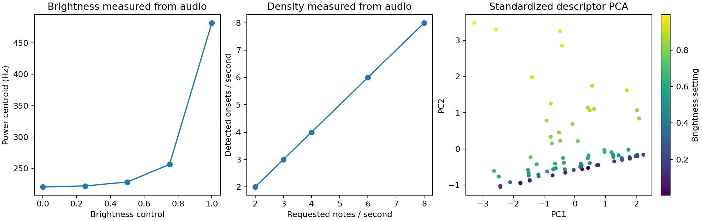

# Controllable Music Co-Creation with Diffusion Models

Research scaffold for an MS thesis on discovering and training continuous,
musically meaningful controls for text-to-audio diffusion models. The approach
adapts SliderSpace-style semantic directions to audio by combining generated
samples, CLAP embeddings, principal component analysis (PCA), and LoRA adapters.

> **Status:** research prototype. The repository currently provides the
> experiment structure and dry-run pipeline; backbone inference, real CLAP
> embeddings, and LoRA optimization are planned integrations.

## Working now: measured audio controls, not random embeddings



The repository now includes a small **real DSP diagnostic**: synthesize plucked
harmonic tones, measure brightness/onsets/RMS from the waveforms, standardize
those descriptors, fit PCA, and evaluate unseen clips. It replaces no diffusion
model and makes no CLAP/LoRA claims. It gives the proposed evaluation pipeline
something audible and testable while those model integrations remain unfinished.

```bash
# Python 3.11, CPU, no checkpoints or accounts needed
python -m pip install -r requirements-demo.txt
python -m unittest -v test_descriptor_demo
python descriptor_demo.py
```

**Listen to the controls:**

- Brightness: [dark](results/descriptor-demo/brightness-0.wav),
  [middle](results/descriptor-demo/brightness-2.wav),
  [bright](results/descriptor-demo/brightness-4.wav).
- Density: [2 notes/sec](results/descriptor-demo/density-0.wav),
  [4 notes/sec](results/descriptor-demo/density-2.wav),
  [8 notes/sec](results/descriptor-demo/density-4.wav).

Measured results, seed 7:

- Brightness sweep raises the power-spectral centroid from **220.5 to 482.1 Hz**
  while measured note rate stays at 4/sec and RMS stays constant.
- Density sweep measures **2, 3, 4, 6, 8 onsets/sec**, matching the rendered rates.
  RMS increases with density; this is explicitly not a loudness-normalized control.
- Two PCA directions retain **99.85%** of standardized descriptor variance over
  80 synthesized training clips. Reconstruction on 20 independent clips has
  standardized RMSE **0.0427**.

[Metrics, PCA parameters and sweeps](results/descriptor-demo/metrics.json) are
committed with the audio and plot. Five tests check seeds, signal range,
monotonicity, onset detection, held-out projection and input validation. CI
regenerates the experiment without any proprietary data or model downloads.

**Important distinction:** PCA axes explain variance, not automatically semantic
or independent controls. The synthesizer's controls are known by construction;
this is an evaluation diagnostic, not evidence that semantic directions have
been discovered in a diffusion model. Integrating a licensed backbone and real
audio embeddings is still required for the thesis pipeline below.

## Research question

Can a musician start from a text prompt and steer independent properties such
as brightness, density, ambience, or rhythmic activity without retraining the
full diffusion model?

## Proposed pipeline

1. Sample multiple clips for a fixed prompt while varying diffusion seeds.
2. Embed each clip with an audio–text representation model such as CLAP.
3. Apply PCA to discover dominant directions in the prompt-conditioned audio
   manifold.
4. Train lightweight LoRA adapters whose embedding shifts align with selected
   directions.
5. Evaluate direction consistency with audio descriptors, prompt alignment,
   and listening tests.

## Run the scaffold

```bash
git clone https://github.com/takakhoo/audio-diffusion-control.git
cd audio-diffusion-control
python -m venv .venv
source .venv/bin/activate  # Windows: .venv\Scripts\activate
python -m pip install -r requirements.txt

python scripts/generate_samples.py
python scripts/compute_embeddings.py --concept solo_jazz_guitar_warm_tone_swing_feel
python scripts/run_pca.py --concept solo_jazz_guitar_warm_tone_swing_feel
python scripts/train_sliders.py --concept solo_jazz_guitar_warm_tone_swing_feel
```

These commands execute the repository's deterministic scaffold from generated
placeholder clips through embeddings, PCA, and a saved slider-training plan.
They validate data flow and configuration; they do not run a diffusion model,
compute real CLAP embeddings, or train a usable audio slider.
Saved stub artifacts now identify their actual backend as placeholder noise or
placeholder random embeddings, rather than incorrectly recording the configured
Stable Audio/CLAP model name as though that model had run.

## Verification

The four-stage scaffold was run end to end on September 16, 2026. It produced
placeholder clips, embeddings, PCA artifacts, and a slider-training plan for
the documented concept. This verifies orchestration and artifact contracts,
not the still-unimplemented backbone, CLAP, or LoRA integrations.

## Repository map

- `configs/model_config.yaml` — model, prompt, and output configuration
- `scripts/generate_samples.py` — sample-generation interface and placeholder
- `scripts/compute_embeddings.py` — embedding stage interface and placeholder
- `scripts/run_pca.py` — PCA stage and explained-variance artifacts
- `scripts/train_sliders.py` — LoRA training plan/interface
- `latex/ms_thesis_notes.tex` — method notes and open research questions
- `Papers/SliderSpacePaper.pdf` — motivating reference paper

## Evaluation plan

Candidate controls should be judged on monotonicity across slider strengths,
semantic independence, prompt preservation, perceptual quality, and agreement
between objective MIR descriptors and human listening tests.
